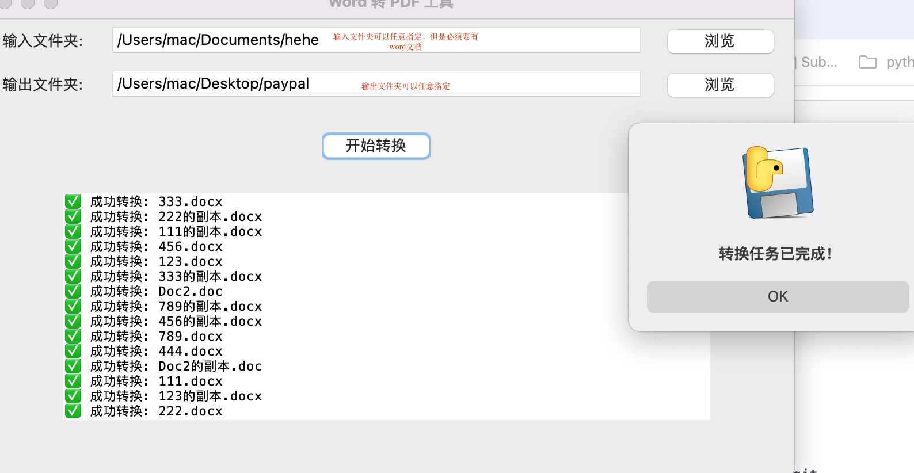

# wordtopdf_mac
 
## 项目介绍
由于工作需要，经常要将word文档编辑完成后转成pdf进行保存，对于批量的word转换成pdf，手工转换费时费力，于是用python脚本开发了word转换pdf的工具，供大家使用。
 
## 功能特性
- 自动生成输入文件夹（输入文件夹存放准备转换的word文档）和输出文件夹（输出文件夹用于存放转换生成的pdf文件）；
- 任意指定输入文件夹和输出文件夹；
- word文档支持的格式为.doc,.docx.
## Screenshot

 
## 安装使用
```bash
# 克隆项目
git clone https://github.com/Gzcsb60123/wordtopdf_mac.git
 
# 安装依赖
# No external Python package dependencies required
# Project relies on standard library: tkinter, subprocess, os
# LibreOffice 的 macOS 默认安装路径
LIBREOFFICE_PATH = "/Applications/LibreOffice.app/Contents/MacOS/soffice"
- Python 3.11 (or compatible version)
- LibreOffice (for Word to PDF conversion) #macos版本下载链接   
  - On macOS: Install via `brew install --cask libreoffice` or download from [Download LibreOffice for macOS](https://downloadarchive.documentfoundation.org/libreoffice/old/24.2.7.2/mac/x86_64/LibreOffice_24.2.7.2_MacOS_x86-64.dmg)


# 默认输入和输出文件夹（使用 macOS 的用户主目录）
DEFAULT_INPUT_FOLDER = "~/Documents/input"
DEFAULT_OUTPUT_FOLDER = "~/Documents/output"
 
# 启动项目
npm run dev

#打包程序下载
## Download
- [WordToPDF.app](WordToPDF.app)
